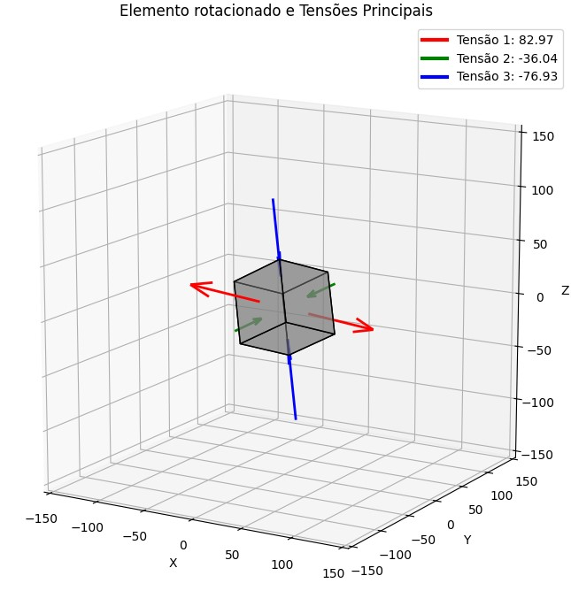

# Análise de Tensões Principais em Elementos 3D

Este repositório contém um script Python para a visualização de tensões principais em um elemento 3D. O script calcula as tensões principais de um tensor de tensão dado e as exibe graficamente em um elemento rotacionado, representando as direções e magnitudes das tensões.

## Requisitos

Para executar este script, você precisará, além de Python, das seguintes bibliotecas Python:

- matplotlib
- numpy

## Instalação

Para instalar as bibliotecas necessárias, você pode usar o seguinte comando:

```bash
pip install matplotlib numpy
```

## Uso

Para usar este script, basta clonar o repositório e executar o arquivo `Tensões principais.py`:

```bash
git clone https://github.com/EVWTRENTINI/Tens-es-Principais
cd Tens-es-Principais
python Tensões principais.py
```

O script gerará um gráfico 3D que mostra um elemento com vetores representando as tensões principais. Uma legenda é incluída para indicar os valores das tensões principais.

## Personalização

### Mudando o Tensor de Tensão

Para alterar o tensor de tensão, modifique o array `tensor` no início do script. O tensor é definido como um array NumPy 3x3, representando as componentes de tensão no elemento. Por exemplo:

```python
tensor = np.array([[-30.,  40.,   0.],
                   [ 40.,  50., -50.],
                   [  0., -50., -50.]])
```      

## Screenshots
<p align="center">
  
</p>

## Links
* __Email para contato__: [etrentini@ufu.br](mailto:etrentini@ufu.br)
